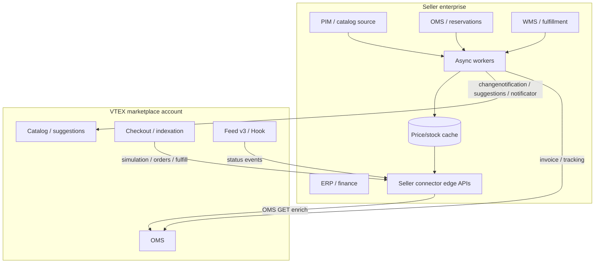

This reference provides guidance for AI agents supporting **VTEX marketplace and External Seller solution architecture**. Apply these constraints and patterns when scoping, designing, or reviewing an External Seller connector or marketplace integration program — integration boundaries, identity models, catalog governance, fulfillment protocol vs OMS callbacks, order notification strategy, and API capacity as non-functional requirements. Use with `SKILL.md` and `architecture-well-architected.md`; this file does not replace marketplace product implementation skills or API how-tos.

# External Seller — Solution Architecture

## When this reference applies

Use when the task is **integration design or review** for a VTEX Marketplace program — before or alongside implementation planning.

- Scoping an **External Seller connector** (catalog, orders, fulfillment, resilience).
- Drawing **integration boundaries** between the seller’s systems (PIM, OMS, WMS, ERP) and the VTEX marketplace account.
- Choosing **order notification** and **catalog governance** models at program level.
- Running an **architecture review** on an existing or proposed marketplace integration.
- Producing **RFP-level** technical structure, phased rollout, or NFRs (latency, throughput, security).

Do **not** use this file for changenotification handlers, fulfillment protocol handlers, Feed/Hook endpoints, retry queues, or circuit-breaker implementation — route those to marketplace product documentation and engineering teams. For cross-pillar commerce architecture (security baseline, native-first, operational model), use `architecture-well-architected.md`.

## Decision rules

### 1. Clarify the integration role

| Role                            | Owns catalog in VTEX?                   | Typical integration                                                                                               |
| ------------------------------- | --------------------------------------- | ----------------------------------------------------------------------------------------------------------------- |
| **External Seller (connector)** | No — suggestions and notifications only | Change Notification + SKU Suggestion; seller-hosted fulfillment protocol; OMS invoice/tracking **to** marketplace |
| **Marketplace operator**        | Yes — direct Catalog API                | SKU approval, marketplace catalog ops; may consume seller suggestions                                             |

Seller connectors **must not** be designed as if they own the marketplace catalog. Marketplace operators **must not** push seller SKUs via the seller notification APIs.

### 2. Capability map and ownership

| Capability                         | Direction                | Owner (seller side)                | Platform contract (summary)                                                                  |
| ---------------------------------- | ------------------------ | ---------------------------------- | -------------------------------------------------------------------------------------------- |
| SKU existence / updates            | Seller → VTEX            | Catalog sync service               | `changenotification/{sellerId}/{sellerSkuId}` → 200 (exists) or 404 (suggest)                |
| New SKU onboarding                 | Seller → VTEX            | Catalog sync + ops handoff         | `PUT` suggestion on `api.vtex.com` → marketplace **approval** (human/semi-auto)              |
| Price / inventory refresh          | Seller → VTEX → Seller   | Notification + **pull** simulation | Notificator price/inventory → marketplace calls seller **`POST /pvt/orderForms/simulation`** |
| Checkout / indexation availability | VTEX → Seller            | Fulfillment edge (low latency)     | Simulation **≤ 2.5 s** or offer unavailable                                                  |
| Order reservation                  | VTEX → Seller            | OMS / reservation                  | `POST /pvt/orders` → return **`orderId`** = reservation                                      |
| Dispatch authorization             | VTEX → Seller            | WMS / fulfillment                  | `POST /pvt/orders/{sellerOrderId}/fulfill`                                                   |
| Invoice & tracking                 | Seller → VTEX            | Billing / logistics                | OMS paths use **`marketplaceOrderId`**, not reservation id                                   |
| Order status awareness             | VTEX → Seller (optional) | ERP / middleware                   | Feed v3 **pull** or Hook **push** (+ OMS enrich)                                             |
| API sustainability                 | Both                     | Integration platform               | Throttling, backoff, circuit breaking — **capacity**, not optional polish                    |

### 3. Identity model (model explicitly in every design)

Three identifiers routinely get conflated; the architecture **must** document mappings and storage:

| Identifier                         | Meaning                                                | Used where                                                                                  |
| ---------------------------------- | ------------------------------------------------------ | ------------------------------------------------------------------------------------------- |
| **sellerSkuId**                    | Seller’s catalog code                                  | Seller-scoped `changenotification`, suggestions, simulation `items[].id`, notificator paths |
| **Marketplace SKU ID**             | VTEX catalog SKU id                                    | Single-segment `changenotification/{skuId}` only when you already have VTEX’s id            |
| **Reservation / seller `orderId`** | Seller system order key returned at `POST /pvt/orders` | `sellerOrderId` in fulfill path                                                             |
| **marketplaceOrderId**             | VTEX OMS order id                                      | Invoice, tracking, cancel, Hook `OrderId`, OMS GET                                          |

```text
Identity boundary (mandatory in integration design):
  sellerSkuId ──maps──▶ (after approval) marketplace SKU ID
  reservation orderId ──maps──▶ marketplaceOrderId (at placement/fulfill/events)
```

### 4. Catalog governance

- **New SKUs**: Always plan for **suggestion → pending → approved/denied**. Updates to suggestions apply only while **Pending**; post-approval changes go through **changenotification** + simulation pull.
- **Bulk catalog migration**: Size **notification throughput** and **operator approval** capacity; do not assume instantaneous marketplace assortment.
- **Price/inventory**: Treat as **eventual consistency** — seller notifies; marketplace **pulls** truth via simulation within SLA.

### 5. Fulfillment protocol vs OMS follow-up

Split the design into two planes:

1. **Inbound protocol (VTEX → seller host)** — simulation, placement, authorize fulfill. Drives **edge performance**, caching, and geographic placement of the seller API.
2. **Outbound OMS (seller → VTEX)** — invoice and tracking after physical fulfillment. Drives **financial reconciliation**, partial shipments, and cancellation rules (return invoice before cancel when invoiced).

Simulation serves **both indexation and checkout**. Architecture must plan for **minimal** vs **full checkout context** on the same endpoint without mixing SLAs (cache-first for hot path).

### 6. Order integration style

| Pattern                 | When to choose                                       | Architectural implication                                                |
| ----------------------- | ---------------------------------------------------- | ------------------------------------------------------------------------ |
| **Hook (push)**         | Near-real-time ERP/WMS; team can run always-on HTTPS | Sub-second ack path; **async** processing; auth at edge; scale for burst |
| **Feed v3 (pull)**      | ERP with limited throughput; batch-friendly          | Scheduler ownership; commit semantics; you control pace                  |
| **Feed as backup**      | Hook primary                                         | Reconciliation job; dedupe shared with Hook                              |
| **List Orders polling** | Avoid for change detection                           | Indexing lag; rate-limit risk — ad-hoc queries only                      |

- **FromWorkflow** vs **FromOrders** filters are **mutually exclusive** per configuration — choose at design time, not “use both.”
- Hook payload is **thin** (`OrderId`, `State`) — architecture must include **OMS enrichment** step and idempotent processing keyed by `OrderId` + `State` + `LastChange`.

### 7. API capacity and resilience (NFRs)

- Treat VTEX rate limits as a **platform contract**: burst credits, `429` + `Retry-After`, optional `X-RateLimit-Remaining` — design **proactive** slowdown, not only reactive retry.
- Catalog batch sync and aggressive Feed polling are common **account-wide outage** triggers (including Admin unavailability).
- **Pricing API** has published ceilings (e.g. 40 PUT/POST per second per account with burst pool) — separate capacity line item from generic catalog traffic.

## Hard constraints

### Constraint: External sellers do not write the marketplace catalog directly

Seller integrations **must** use Change Notification + SKU Suggestion (and related notificators), not marketplace Catalog API product/SKU creation.

**Why this matters**

Bypassing approval breaks marketplace quality control, causes 403 errors, or creates orphaned catalog rows that operations cannot reconcile.

**Detection**

Architecture diagrams or data flows that show sellers calling `POST /api/catalog/pvt/product` or stockkeepingunit creation on the marketplace account → **stop** and redraw the suggestion path.

**Correct**

```text
Seller catalog service → changenotification (sellerId/sellerSkuId)
  → 404? → suggestion API (api.vtex.com) → marketplace ops approval
  → approved SKU → updates via changenotification + simulation pull
```

**Wrong**

```text
Seller PIM → direct Catalog API write on marketplace account
  ("faster sync" without marketplace approval gate)
```

---

### Constraint: Model two order ID domains with an explicit mapping store

Every design **must** persist and document how **reservation / seller `orderId`** maps to **`marketplaceOrderId`** before any OMS invoice, tracking, or cancel flow.

**Why this matters**

Using the reservation id in OMS URLs is a frequent integration defect: invoices and tracking never attach to the shopper order, and finance reconciliation fails.

**Detection**

Single “orderId” field in integration specs; OMS arrows labeled without “marketplace” qualifier; fulfill body `marketplaceOrderId` not stored → **stop**.

**Correct**

```text
At POST /pvt/orders: persist reservationId per line
At POST /pvt/orders/{sellerOrderId}/fulfill: persist marketplaceOrderId + group
All OMS invoice/tracking: path = marketplaceOrderId only
```

**Wrong**

```text
Invoice service uses "orderId from placement response" for OMS POST
  (no mapping table; same name in docs for two different ids)
```

---

### Constraint: Fulfillment simulation is a sub-2.5-second hot path

The seller-hosted simulation endpoint is on the **commerce critical path** (indexation and checkout). Architecture **must** specify how price, stock, and SLAs are served within **2.5 seconds** — typically pre-computed cache or read replicas, not live fan-out to slow ERP APIs.

**Why this matters**

Breaching the SLA marks offers **unavailable** — direct revenue and conversion impact, not a background sync delay.

**Detection**

Simulation box calls “ERP + carrier APIs synchronously” with no cache tier; no SLO or p95 target → **stop**.

**Correct**

```text
Price/stock/SLA materialized view (cache/DB) ← async updates from PIM/OMS
Simulation handler: read materialized view only (p95 < 1s target)
Checkout branch: return logisticsInfo + slas when request includes shipping context
```

**Wrong**

```text
Simulation → real-time ERP pricing + multi-carrier rating on every VTEX request
  (no cache; "we'll optimize in phase 2")
```

---

### Constraint: Order Hook requires fast acknowledge and trustworthy edge

If Hook is selected, the architecture **must** include: authenticated ingress, **≤ 5 s** HTTP 200 to VTEX, **async** downstream processing, and **idempotent** consumption (`OrderId` + `State` + `LastChange`).

**Why this matters**

Slow handlers cause retries and duplicate side effects; missing auth allows fraudulent events; duplicate processing causes double fulfillment or billing.

**Detection**

Hook handler tied to synchronous ERP write in the request thread; no deduplication store; no `Origin` validation in security model → **stop**.

**Correct**

```text
Hook edge: validate Origin + custom header → enqueue event → 200 OK
Worker: dedupe key → GET OMS order → domain workflow
Optional: Feed poller as reconciliation for missed Hook windows
```

**Wrong**

```text
Hook → blocking ERP create (10–30s) → then 200 OK
  (no queue; no idempotency; "ERP must be synchronous")
```

---

### Constraint: API throttling is a capacity plan, not a developer afterthought

Integrations that bulk-notify catalog, poll Feed aggressively, or retry without backoff **must** have explicit throughput budgets, backoff policy, and circuit-breaking between seller and VTEX.

**Why this matters**

Sustained `429` responses exhaust burst credits and can make the **VTEX Admin** unavailable for the account — a program-level incident, not a single failed job.

**Detection**

No NFR for catalog sync TPS; “poll Feed every second”; no owner for rate-limit incidents → **stop**.

**Correct**

```text
NFR: catalog notify ≤ N req/s with jittered backoff on 429
NFR: Feed interval ≥ 30s (or per VTEX guidance); commit only after success
Ops: monitor X-RateLimit-Remaining; circuit open stops outbound burst
```

**Wrong**

```text
Nightly job pushes 500k changenotifications in parallel
  ("we'll add retries if VTEX complains")
```

## Preferred pattern

### Reference architecture (External Seller connector)



### Phased delivery (typical)

1. **Foundation** — Identity mapping, credentials, environments, observability, rate-limit policy.
2. **Catalog** — Suggestion workflow + changenotification; operator approval runbook; simulation cache.
3. **Commerce path** — Simulation (indexation + checkout) → placement → fulfill handshake.
4. **Post-purchase** — OMS invoice/tracking; partial shipment model; return-invoice cancel path.
5. **Order awareness** — Hook or Feed (+ optional backup); ERP alignment on status matrix.
6. **Hardening** — Load tests on simulation and batch catalog; DR for seller edge; Feed reconciliation.

### Architecture decision log (template)

```text
Program: [External Seller → Marketplace X]
Roles: Seller connector (not marketplace catalog owner)

Catalog: Suggestion + changenotification; approval SLA owned by [team]
Simulation: Cache tier [Redis/DB]; p95 target [ms]; checkout logistics [yes/no]
Orders: Hook | Feed | both (primary/backup)
Idempotency store: [technology]; Hook ack [async queue]
Order IDs: mapping store [system] at placement + fulfill
OMS: invoice per package [yes/no]; return invoice before cancel [documented]
API capacity: catalog TPS [N]; Feed interval [s]; 429 runbook [owner]
Implementation streams → marketplace-catalog-sync | fulfillment | order-hook | rate-limiting
```

## Common failure modes

- **Treating the connector as catalog owner** — Direct Catalog API in seller scope; no marketplace approval workflow or ops staffing.
- **Single order identifier in enterprise MDM** — Reservation and marketplace ids conflated; OMS and ERP disagree on which key is canonical.
- **Simulation as synchronous ERP** — Checkout timeouts and inactive SKUs under load; no materialized price/stock layer.
- **Hook without async boundary** — Timeouts, retries, duplicate WMS tasks; Hook deactivation under sustained failure.
- **Polling List Orders for integration** — Stale state, rate limits, and unnecessary OMS load instead of Feed/Hook.
- **Suggestion status polling in real time** — API quota burned on human approval timelines; no operational expectation for approval SLA.
- **Invoice before fulfill authorization** — Financial and status inconsistency when payment or fraud review is still open.
- **Full-order invoice on partial ship** — Marketplace reconciliation and customer communication break on split fulfillments.
- **Cancel invoiced order without return invoice** — Cancel API rejected; manual ops intervention.
- **Rate limits discovered in production** — Bulk catalog migration or tight loops block account Admin; no proactive quota monitoring.

## Review checklist

- [ ] Is the integration role explicit (**External Seller** vs **marketplace operator**)?
- [ ] Is catalog flow **suggestion-gated** for new SKUs (not direct Catalog API from seller)?
- [ ] Are **sellerSkuId**, **marketplace SKU ID**, **reservation id**, and **marketplaceOrderId** documented with a mapping store?
- [ ] Is **fulfillment simulation** designed for **≤ 2.5 s** (cache/materialized reads, not slow ERP on hot path)?
- [ ] Are **indexation** vs **checkout** simulation behaviors both addressed on the same endpoint?
- [ ] Is **order notification** chosen (Hook vs Feed) with mutual-exclusive filter type and optional Feed backup?
- [ ] Does Hook design include **auth**, **≤ 5 s ack**, **async** processing, and **idempotency**?
- [ ] Is **OMS invoice/tracking** scoped to **marketplaceOrderId** with partial-shipment and return-invoice rules?
- [ ] Is physical fulfillment sequenced **after** authorize-fulfill, with tracking after carrier handoff?
- [ ] Are **API throughput**, backoff, and circuit-breaking **NFRs** owned (catalog batch, Feed interval, 429 runbook)?
- [ ] Does every implementation stream map to a **marketplace product skill**?
